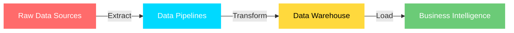

<div align="center">

<!-- Animated Header -->


<!-- Typing Effect -->
<a href="https://git.io/typing-svg"></a>

<br/>

<!-- Animated Badges -->


<br/><br/>

<!-- Profile Counters -->

&nbsp;
<a href="https://github.com/GuruprasadaShridharHegde?tab=followers"></a>

</div>

<br/>

<!-- Horizontal Divider with Gradient -->


<br/>

##  &nbsp;About Me


```yaml
name: Guruprasada Shridhar Hegde
location: Bangalore, India 🇮🇳
role: Data Engineer

about:
  - Building scalable ETL/ELT pipelines
  - Designing cloud data platforms on AWS
  - Orchestrating workflows with Apache Airflow
  - Optimizing database performance at scale
  - Containerizing everything with Docker

education:
  degree: Bachelor of Engineering (ECE)
  university: Dayananda Sagar College of Engineering

philosophy: |
  "Your future is created by what you do today, 
   not tomorrow."

currently_exploring:
  - Real-time data streaming
  - Advanced data modeling patterns
  - Data mesh architecture
```

<br clear="both"/>

<br/>


<br/>

##  &nbsp;Tech Stack

<div align="center">

<!-- Using Skill Icons for a cleaner, more visual look -->
<a href="https://skillicons.dev">

</a>

</div>

<br/>

<div align="center">

<table>
<tr>
<td align="center" width="20%">

**⚡ Languages**
<br/><br/>


</td>
<td align="center" width="20%">

**🚀 Frameworks**
<br/><br/>


</td>
<td align="center" width="20%">

**🗄️ Databases**
<br/><br/>


</td>
<td align="center" width="20%">

**☁️ Cloud & DevOps**
<br/><br/>


</td>
<td align="center" width="20%">

**🔧 Tools**
<br/><br/>


</td>
</tr>
</table>

</div>

<br/>


<br/>

##  &nbsp;What I Do

<div align="center">



</div>

<div align="center">

| 🏗️ Architecture | ⚙️ Engineering | 📈 Optimization |
|:---:|:---:|:---:|
| Data Warehousing | ETL/ELT Pipelines | Query Performance |
| Cloud Platforms | Workflow Orchestration | Cost Optimization |
| Data Modeling | CI/CD Automation | System Reliability |
| API Development | Containerization | Processing Speed |

</div>

<br/>


<br/>

## 🏆 GitHub Trophies

<div align="center">

</div>

<br/>


<br/>

##  &nbsp;GitHub Metrics

<div align="center">
  
  
</div>

<br/>

<div align="center">
  
</div>

<br/>

<!-- Activity Graph -->
<div align="center">
  
</div>

<br/>


<br/>

## 🐍 The Zen of Python

<div align="center">

```python
>>> import this

"""
Beautiful is better than ugly.
Explicit is better than implicit.
Simple is better than complex.
Complex is better than complicated.
Flat is better than nested.
Sparse is better than dense.
Readability counts.
Now is better than never.
If the implementation is hard to explain, it's a bad idea.
If the implementation is easy to explain, it may be a good idea.
Namespaces are one honking great idea -- let's do more of those!
"""
```

</div>

<br/>


<br/>

## 🌐 Let's Connect

<div align="center">

<a href="https://linkedin.com/in/guruprasadashridharhegde/" target="_blank"></a>&nbsp;
<a href="https://instagram.com/guruprasada_s_hegde/" target="_blank"></a>&nbsp;
<a href="https://facebook.com/profile.php?id=100083385574254" target="_blank"></a>&nbsp;
<a href="https://stackoverflow.com/users/19766956" target="_blank"></a>&nbsp;
<a href="https://quora.com/profile/Guruprasada-Shridhar-Hegde-1DS19EC414" target="_blank"></a>&nbsp;
<a href="https://discord.gg/cZ7FTQf7XH" target="_blank"></a>&nbsp;
<a href="https://api.whatsapp.com/send?phone=919482152447" target="_blank"></a>&nbsp;
<a href="https://tinyurl.com/wpx6zr2e" target="_blank"></a>

</div>

<br/>


<br/>

<div align="center">

### ⚡ "No man ever steps in the same river twice, for it's not the same river and he's not the same man."

<br/>


</div>
