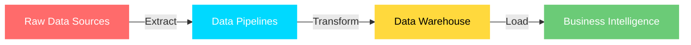

<!-- ===================== ANIMATED HEADER ===================== -->
<div align="center">


<!-- Animated waving hand + intro -->


<br/><br/>

<!-- Info badges -->


<br/><br/>


&nbsp;
<a href="https://github.com/GuruprasadaShridharHegde?tab=followers"></a>

<br/>

<!-- Animated rainbow divider -->


</div>

<!-- ===================== ABOUT ME ===================== -->
<div align="center">

</div>


```yaml
name: Guruprasada Shridhar Hegde
location: Bangalore, India 🇮🇳
role: Data Engineer

what_i_build:
  - Scalable ETL / ELT data pipelines
  - Cloud data platforms on AWS
  - Orchestrated workflows with Apache Airflow
  - High-performance analytical warehouses
  - Containerized, CI/CD-driven deployments

education:
  degree: Bachelor of Engineering (ECE)
  university: Dayananda Sagar College of Engineering

currently_exploring:
  - Real-time data streaming
  - Advanced data modeling patterns
  - Data mesh architecture

philosophy: |
  "Your future is created by what you do today,
   not tomorrow."
```

<br clear="both"/>

<div align="center">

</div>

<!-- ===================== TECH STACK ===================== -->
<div align="center">


<br/>

<!-- Animated tech icons -->


<br/><br/>

<a href="https://skillicons.dev">

</a>

<br/><br/>


<br/>

<table>
<tr>
<td align="center" width="20%">

**⚡ Languages**
<br/><br/>


</td>
<td align="center" width="20%">

**🚀 Frameworks**
<br/><br/>


</td>
<td align="center" width="20%">

**🗄️ Databases**
<br/><br/>


</td>
<td align="center" width="20%">

**☁️ Cloud & DevOps**
<br/><br/>


</td>
<td align="center" width="20%">

**🔧 Tools**
<br/><br/>


</td>
</tr>
</table>


</div>

<!-- ===================== WHAT I DO ===================== -->
<div align="center">


<br/>




| 🏗️ Architecture | ⚙️ Engineering | 📈 Optimization |
|:---:|:---:|:---:|
| Data Warehousing | ETL / ELT Pipelines | Query Performance |
| Cloud Platforms | Workflow Orchestration | Cost Efficiency |
| Data Modeling | CI/CD Automation | System Reliability |
| API Development | Containerization | Processing Speed |


</div>

<!-- ===================== CERTIFICATIONS ===================== -->
<div align="center">


<br/>


<br/><br/>


&nbsp;


<br/><br/>


&nbsp;


<br/>


</div>

<!-- ===================== ZEN OF PYTHON ===================== -->
<div align="center">


<br/>


<br/><br/>

<!-- Animated typing of the Zen -->


<br/>


</div>

<!-- ===================== CONNECT ===================== -->
<div align="center">


<br/>


<br/><br/>

<a href="https://linkedin.com/in/guruprasadashridharhegde/" target="_blank"></a>&nbsp;
<a href="https://instagram.com/guruprasada_s_hegde/" target="_blank"></a>&nbsp;
<a href="https://facebook.com/profile.php?id=100083385574254" target="_blank"></a>&nbsp;
<a href="https://stackoverflow.com/users/19766956" target="_blank"></a>

<br/><br/>

<a href="https://quora.com/profile/Guruprasada-Shridhar-Hegde-1DS19EC414" target="_blank"></a>&nbsp;
<a href="https://discord.gg/cZ7FTQf7XH" target="_blank"></a>&nbsp;
<a href="https://api.whatsapp.com/send?phone=919482152447" target="_blank"></a>&nbsp;
<a href="https://tinyurl.com/wpx6zr2e" target="_blank"></a>

<br/>


</div>

<!-- ===================== FOOTER ===================== -->
<div align="center">


<br/>


</div>
